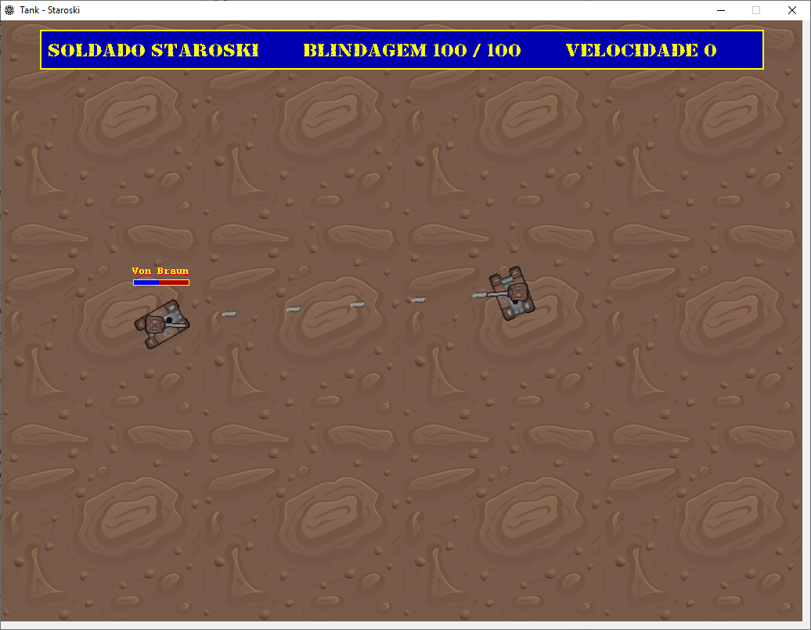

# TANK

### Jogo multiplayer em Java.

Para jogar siga os seguintes passos:

1. Execute esta classe para subir o **Servidor RMI**:

        br.com.staroski.games.tank.server.StartupTankServer
        
    Observe o valor do campo **"Instância do jogo"**.

2. Execute esta classe para subir o **Cliente AWT/Swing**:

        br.com.staroski.games.tank.client.StartupTankClient

    No campo **"Instância do jogo"**, insira o valor do mesmo campo apresentado no **Servidor RMI**.

### Atenção:

    O jogo utiliza a **porta 8008**, se você tiver problemas para acessar esta porta, altere o valor da contante **PORT** na seguinte classe:
    
        br.com.staroski.games.ObjectBinder

### Bom divertimento!

